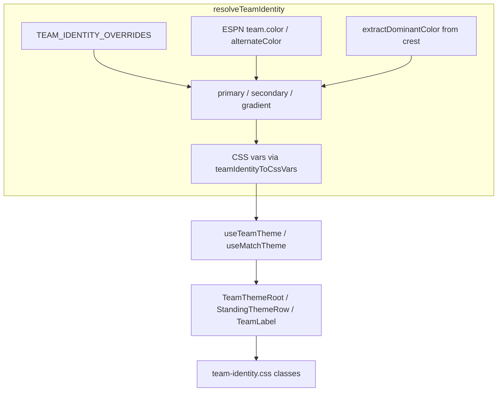

# Team Identity System — Completion Plan

## Audit vs. Actual Branch

Your audit targets `cursor/zustand-vitest-c0dd7` on GitHub, which does **not** yet include the team-identity work. Locally (uncommitted), a more capable system already exists:

| Your audit proposes | Already exists locally |
|---|---|
| `src/data/teamIdentity.ts` — static 32-team map | [`src/lib/teamIdentity.ts`](src/lib/teamIdentity.ts) — runtime resolver |
| `src/hooks/useTeamTheme.ts` (simple lookup) | [`src/hooks/useTeamTheme.ts`](src/hooks/useTeamTheme.ts) — store-backed + async crest extraction |
| `useMatchTheme` in same file | [`src/hooks/useMatchTheme.ts`](src/hooks/useMatchTheme.ts) — composes two identities |
| `src/styles/team-tokens.css` | [`src/styles/team-identity.css`](src/styles/team-identity.css) — imported in [`src/main.tsx`](src/main.tsx) |
| Manual wiring per component | Themed primitives: `TeamThemeRoot`, `TeamLabel`, `StandingThemeRow`, `BracketTeamButton` |

**Critical data mismatch:** Your audit lists 32 teams from WC 2022 (QAT, ECU, SEN…). This app is **WC 2026** with **48 teams** across groups A–L ([`src/types.ts`](src/types.ts) `groupLetters`, [`TeamsView`](src/components/views/TeamsView.tsx) copy). Do not paste the 2022 roster.



---

## What Is Already Wired

| Surface | File | Status |
|---|---|---|
| Live hero | [`LiveMatchBento.tsx`](src/components/bentos/LiveMatchBento.tsx) | `useMatchTheme` + `live-hero-themed` |
| Schedule cards (live) | [`MatchScheduleCard.tsx`](src/components/match/MatchScheduleCard.tsx) | `useMatchTheme` + accent bar when `isLive` |
| Standings rows | [`GroupsView.tsx`](src/components/views/GroupsView.tsx) via [`StandingThemeRow`](src/components/team/StandingThemeRow.tsx) | Per-row `--team-primary` inset bar |
| Team list | [`TeamsView.tsx`](src/components/views/TeamsView.tsx) via `TeamThemeRoot` | Hover wash on rows |
| Team sheet header | [`TeamDetailSheet.tsx`](src/components/team-detail/TeamDetailSheet.tsx) | Gradient header + accent bar |
| Qual bento crests | [`QualifiedBento.tsx`](src/components/bentos/QualifiedBento.tsx) | `qual-crest-themed` borders |
| Bracket (readonly) | [`BracketBento.tsx`](src/components/bentos/BracketBento.tsx) | `bracket-team-themed` + status attrs |
| Simulator | `SimulatorView` | `TeamLabel` + `BracketTeamButton` |

---

## Remaining Gaps to Close

### 1. Expand manual overrides (15 → 48 teams)

[`src/data/teamIdentityOverrides.ts`](src/data/teamIdentityOverrides.ts) currently has 15 entries; two (`ITA`, `COL`) are not WC 2026 participants.

**Action:**
- Run [`scripts/seed-team-identity.mjs`](scripts/seed-team-identity.mjs) against the ESPN 2026 scoreboard to get abbrev + ESPN colors for all teams
- Merge output into `TEAM_IDENTITY_OVERRIDES`, replacing wrong entries and filling gaps
- Hand-tune high-visibility nations where ESPN colors are off-brand (same values from your audit are fine where abbrevs match: BRA, ARG, MEX, USA, etc.)
- Resolver already checks overrides first in [`resolveTeamIdentity`](src/lib/teamIdentity.ts) — no new file needed

### 2. Non-live schedule card theming

[`MatchScheduleCard.tsx`](src/components/match/MatchScheduleCard.tsx) calls `useMatchTheme` but only applies `style={matchTheme}` and `team-accent-bar` when `isLive`. Completed/scheduled cards get the class `schedule-card-themed` but CSS only styles `.schedule-card-themed.is-live`.

**Action:** Apply a subtler variant for non-live cards — e.g. a faint dual-team border or 5% gradient wash — by extending [`team-identity.css`](src/styles/team-identity.css) with `.schedule-card-themed` (not only `.is-live`) and always passing `matchTheme` inline style.

### 3. Group header mini-crests

[`GroupsView.tsx`](src/components/views/GroupsView.tsx) lines 36–40 render plain `` crests in `mini-qualifiers` with no team vars.

**Action:** Wrap each crest in `TeamThemeRoot` + `qual-crest-themed` (same pattern as [`QualifiedBento`](src/components/bentos/QualifiedBento.tsx)).

### 4. Adopt or remove `.team-card`

[`.team-card`](src/styles/team-identity.css) is defined but unused. Two options (pick one during implementation):

- **Use it:** Change `TeamsView` rows from `team-row-themed` to `team-card` + `team-accent-bar` for richer card chrome
- **Remove it:** Delete unused CSS to avoid drift with your audit's `team-card` spec

Recommendation: use `.team-card` on `TeamsView` list items — it matches your audit's visual intent without a new stylesheet.

### 5. Missing-team fallbacks

When `home`/`away` is undefined, [`MatchScheduleCard`](src/components/match/MatchScheduleCard.tsx) and [`LiveMatchBento`](src/components/bentos/LiveMatchBento.tsx) render plain `<span className="team-label">` without CSS vars.

**Action:** Add a lightweight `TeamLabelById` (or extend `TeamLabel`) that accepts `teamId` string and applies `useTeamTheme` even when the `Team` object is missing from store.

### 6. Dead code cleanup

These are defined but never imported:

- [`src/store/selectors/teamIdentitySelectors.ts`](src/store/selectors/teamIdentitySelectors.ts)
- `useTeamThemeByTeam` in [`useTeamTheme.ts`](src/hooks/useTeamTheme.ts)

**Action:** Either wire selectors into non-React code paths (e.g. worker/simulator exports) or delete to reduce surface area. Prefer delete unless a concrete consumer exists.

### 7. Tests

Add Vitest coverage for the resolver pipeline:

- `resolveTeamIdentity` — override beats ESPN beats default
- `pickOnPrimary` — light vs dark primary
- `matchThemeToStyle` — fallback grays when team missing
- `teamIdentityToCssVars` — correct property names

Mirror patterns in existing tests like [`src/lib/scheduleConflict.test.ts`](src/lib/scheduleConflict.test.ts).

---

## Files to Create vs. Skip

| Audit file | Verdict |
|---|---|
| `src/data/teamIdentity.ts` | **Skip** — would duplicate and fight [`src/lib/teamIdentity.ts`](src/lib/teamIdentity.ts) |
| `src/hooks/useTeamTheme.ts` | **Skip** — already exists with richer API |
| `src/styles/team-tokens.css` | **Skip** — merge any missing rules into existing `team-identity.css` |
| `@import` in `styles.css` | **Skip** — `main.tsx` already imports `team-identity.css` directly |

**New files worth adding:**
- `src/lib/teamIdentity.test.ts` — resolver unit tests
- Optionally `src/components/team/TeamLabelById.tsx` — id-only fallback label

---

## CSS Class Name Mapping (audit → actual)

| Audit class | Actual class | Notes |
|---|---|---|
| `standings-row` | `standing-row-themed` | Already used by `StandingThemeRow` |
| `bracket-slot` | `bracket-team-themed` | Used by `BracketBento` / `BracketTeamButton` |
| `live-hero` | `live-hero-themed` | Base `live-hero` in `app-views.css` |
| `team-card` | `team-card` | Defined, not yet used |

---

## Suggested Implementation Order

1. Run seed script → expand `teamIdentityOverrides.ts` for all 48 teams
2. Fix non-live `MatchScheduleCard` theming + `TeamLabelById` fallback
3. Theme `mini-qualifiers` crests in `GroupsView`
4. Adopt `.team-card` in `TeamsView` (or remove unused CSS)
5. Add resolver tests; delete unused selectors/hooks
6. Visual QA: Live tab, Groups standings, Teams list, Bracket, Team sheet, Simulator

---

## Commit Strategy

All team-identity files are currently **untracked or modified** locally. After completion, stage as a single feature commit:

```
feat: add team identity theming across views

Runtime resolver with FIFA overrides, ESPN fallbacks, and crest
color extraction. Themed components for standings, matches, bracket,
and team detail surfaces.
```
